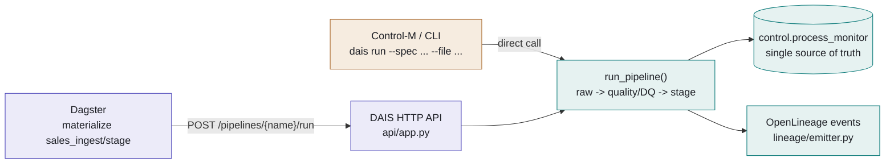
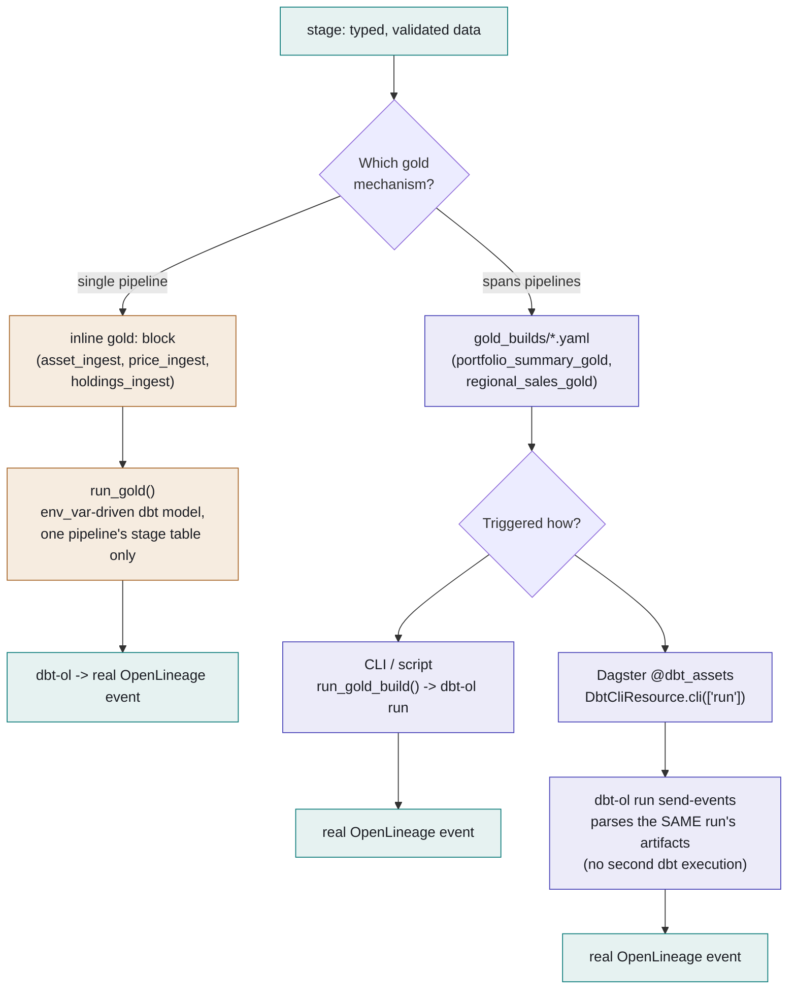

# Two Roads to Gold — Legacy (Control-M) vs. Dagster Orchestration

Dagster didn't replace anything — it sits beside Control-M as a second way
to *trigger* the same pipeline code. Where the two paths genuinely diverge
is gold, and that divergence used to leave a real lineage gap - since
fixed for `gold_builds` (Fig. 2), though the legacy inline path still
isn't modeled as a Dagster asset at all.

**Core rule:** raw and stage always run through the exact same code —
`dais.pipeline.run_pipeline()` — no matter which trigger fired it.
Dagster's ingest assets don't reimplement ingestion; they call the same
HTTP API Control-M's shell wrapper calls. Gold is where the two paths
actually differ, both in mechanism and in what lineage you get.

---

## Fig. 1 — Raw → stage: one execution path, two front doors

Control-M and Dagster are both just callers. Whichever one fires, the run
lands in the same registry, writes the same `process_monitor` rows, and
emits the same OpenLineage events.

- 🟧 Control-M / legacy trigger
- 🟪 Dagster trigger
- 🟩 shared code — identical either way

---

## Fig. 2 — Gold: two mechanisms, now unified on lineage

An ingest pipeline picks exactly one gold mechanism. The legacy inline
block only ever aggregates its own stage table; a `gold_builds` spec can
join several. `gold_builds` used to behave differently depending on *how*
it was run - the Dagster path skipped `dbt-ol` entirely. Fixed: both paths
now emit a real OpenLineage event, without ever running the SQL twice.

- 🟧 legacy inline gold
- 🟪 gold_builds / Dagster
- 🟩 real OpenLineage emitted

> **Fixed (unified lineage):** `gold_assets.py`'s `@dbt_assets` function
> still runs dbt via Dagster's own `DbtCliResource.cli(["run"], ...)` -
> giving Dagster its native per-model asset tracking - but immediately
> afterward calls `dbt-ol run send-events`, pointed at the SAME
> `target_path` that run just wrote `run_results.json`/`manifest.json` to.
> `send-events` is a real mode in the installed `openlineage-dbt` package
> (verified against its source, not assumed) that skips re-running dbt
> entirely and just parses those artifacts - so one dbt run now feeds
> *both* Dagster's own asset graph *and* a real OpenLineage event, with no
> duplicate SQL execution. Applies whenever the build has a `lineage:`
> block, exactly like the CLI path.

---

## Fig. 3 — Side by side

| | **Legacy** — inline `gold:` | **Current** — `gold_builds/*.yaml` |
|---|---|---|
| Scope | One pipeline's own stage table only | Any number of pipelines' stage tables (`depends_on`) |
| dbt wiring | `env_var('DBT_STAGE_SCHEMA')` interpolation | Static `source()` against `sources.yml` |
| Triggered from | `execution.stop_after: gold` on the pipeline spec | CLI script, or a dedicated Dagster job/asset |
| Runs in Dagster? | Not modeled as a Dagster asset today | Yes — `@dbt_assets`, auto-discovered from the yaml |
| OpenLineage | Always, via `dbt-ol` (Phase 9b) | Always, via `run_gold_build()` (CLI) or `dbt-ol run send-events` (Dagster) |

---

## Fig. 4 — One dataset, not two: matching identities end to end

Emitting real OpenLineage events on both sides of the raw/stage → gold
boundary isn't enough by itself. A backend like Marquez connects a graph
by matching **(namespace, name)** dataset identity, not job identity - and
`lineage/emitter.py` and `dbt-ol` used to name the *same physical stage
table* two different ways:

| | Before | After |
|---|---|---|
| `lineage/emitter.py` (raw/stage) | `datamesh-prod` / `data_in.sales_stage` | `postgres://{host}:{port}` / `{dbname}.data_in.sales_stage` |
| `dbt-ol` (gold, unchanged - third-party) | `postgres://{host}:{port}` / `{dbname}.data_in.sales_stage` | *(same, unchanged)* |

`lineage/emitter.py` now derives `db_namespace`/`dbname` from
`connection_params` (already passed into `run_pipeline()` for the legacy
gold path - reused here) and identifies anything shaped `"schema.table"`
using dbt-ol's own convention, verified against its installed source. A
source **file** path (not a table) keeps its original logical namespace -
there's no external identity for it to match.

One more real wrinkle, found and fixed alongside this: `dbt-ol`'s *coarse*
dataset name for a `source()` node uses the source's declared table
**alias**, not its resolved `identifier:` - a different code path inside
the same tool than the one used for column-lineage, which does resolve the
real name. `dbt/models/sources.yml` used a generic `stage` alias for every
pipeline (fine on its own, but it doesn't match `sales_stage`, and using
`stage` everywhere would collide across pipelines besides). Renamed each
alias to match its identifier exactly (`sales_stage`, `holdings_stage`,
...) - one name, no collision, and it now agrees with the real table name
on both the coarse and column-lineage levels.

Verified end to end, not assumed: a real `sales_ingest` run's `stage` step
and a real `regional_sales_gold` dbt-ol run now emit the *identical*
dataset identity - `postgres://localhost:5432` /
`GEODS.data_in.sales_stage` - for both the top-level input/output entries
and the nested column-lineage facet.

---

*Reflects `src/dais/orchestration/dagster/`, `src/dais/medallion/gold.py`,
and `src/dais/lineage/emitter.py` as of the unified-lineage and
matching-dataset-identity fixes. Remaining known gap: the legacy inline
`gold:` path still isn't modeled as a Dagster asset at all - only
`gold_builds/*.yaml` builds show up in Dagster's graph.*
