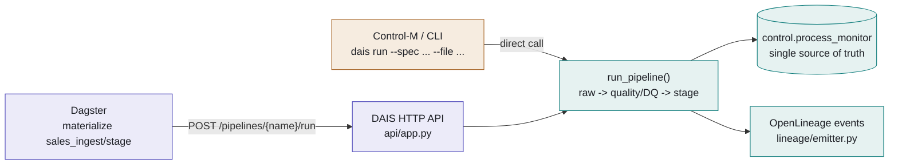
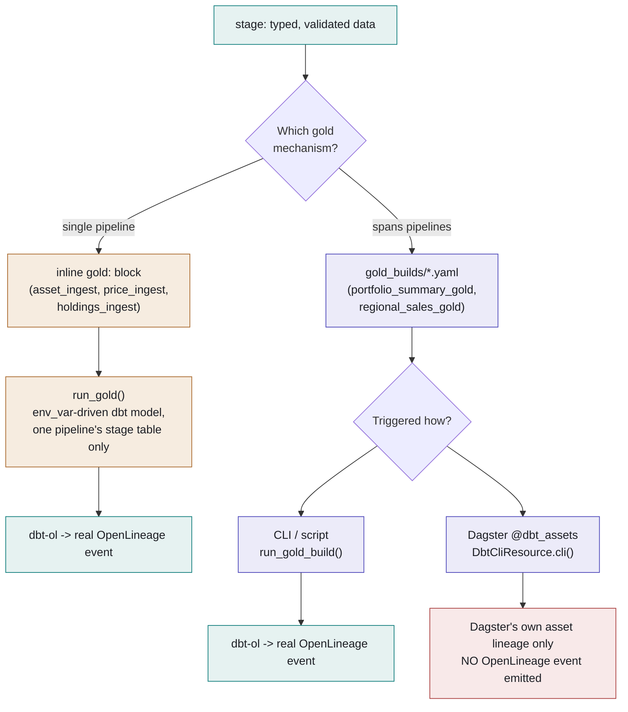

# Two Roads to Gold — Legacy (Control-M) vs. Dagster Orchestration

Dagster didn't replace anything — it sits beside Control-M as a second way
to *trigger* the same pipeline code. Where the two paths genuinely diverge
is gold, and that divergence has a real, currently-open gap in it.

**Core rule:** raw and stage always run through the exact same code —
`dais.pipeline.run_pipeline()` — no matter which trigger fired it.
Dagster's ingest assets don't reimplement ingestion; they call the same
HTTP API Control-M's shell wrapper calls. Gold is where the two paths
actually differ, both in mechanism and in what lineage you get.

---

## Fig. 1 — Raw → stage: one execution path, two front doors

Control-M and Dagster are both just callers. Whichever one fires, the run
lands in the same registry, writes the same `process_monitor` rows, and
emits the same OpenLineage events.

- 🟧 Control-M / legacy trigger
- 🟪 Dagster trigger
- 🟩 shared code — identical either way

---

## Fig. 2 — Gold: two mechanisms, and a lineage gap inside one of them

An ingest pipeline picks exactly one gold mechanism. The legacy inline
block only ever aggregates its own stage table; a `gold_builds` spec can
join several. But `gold_builds` itself behaves differently depending on
*how* it's run.

- 🟧 legacy inline gold
- 🟪 gold_builds / Dagster
- 🟩 real OpenLineage emitted
- 🟥 gap — no OpenLineage emitted

> **Open gap:** Materializing `regional_sales_gold` in Dagster runs the
> identical dbt models as running it from the CLI — but Dagster's path
> calls `DbtCliResource.cli()` directly instead of `run_gold_build()`, so
> it never goes through `dbt-ol`. Same data, same SQL, two different
> lineage outcomes depending on which button you pressed. **Not yet
> fixed** as of Phase 9c.

---

## Fig. 3 — Side by side

| | **Legacy** — inline `gold:` | **Current** — `gold_builds/*.yaml` |
|---|---|---|
| Scope | One pipeline's own stage table only | Any number of pipelines' stage tables (`depends_on`) |
| dbt wiring | `env_var('DBT_STAGE_SCHEMA')` interpolation | Static `source()` against `sources.yml` |
| Triggered from | `execution.stop_after: gold` on the pipeline spec | CLI script, or a dedicated Dagster job/asset |
| Runs in Dagster? | Not modeled as a Dagster asset today | Yes — `@dbt_assets`, auto-discovered from the yaml |
| OpenLineage | Always, via `dbt-ol` (Phase 9b) | Only when run via CLI/script — not yet when run via Dagster |

---

*Reflects `src/dais/orchestration/dagster/` and `src/dais/medallion/gold.py`
as of Phase 9c. The Fig. 2 gap is a real, open item — not yet fixed.*
